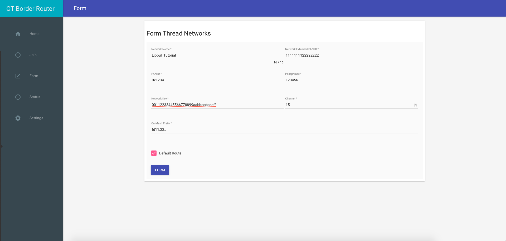

# Network Setup

To send the firmware Over The Air using the [OpenThread](https://openthread.io) network we need to setup an [OpenThread border router](https://openthread.io/guides/border-router).

***
ℹ️ The setup suggested by the [official OpenThread documentation](https://openthread.io/guides/border-router) requires to use a Raspberry Pi 3 or a BeagleBone Black. Since we want to keep the setup simple we will describe a border router configuration when the thread device is directly connected to a computer. However, if you already have such a setup or you prefer to follow the official guide skip the following sections.
***

## Install a Linux Virtual Machine

If you are using Mac OSX you need to install a virtual machine since the OTBR tool provided by
OpenThread works only on Linux.


## Download and flash the border router

To install a Thread border router you can follow two paths:

- clone the repository and build it;
- download an already built version;

Since [OpenThread provides an already built version](https://openthread.io/guides/ncp/firmware) for our board we will follow the second approach.

***
⚠️ We assume you have some knowledge on the Thread networks. If not, you might want to run the [OpenThread Simulation Codelab](https://codelabs.developers.google.com/codelabs/openthread-simulation/#0), to get familiar with the basics Thread concepts.
***

You can download a prebuild version of the firmware using the following commands:

```
$ wget https://openthread.io/guides/ncp/ot-ncp-ftd-gccb354fb-nrf52840.tar.gz
$ tar -xzvf ot-ncp-ftd-gccb354fb-nrf52840.tar.gz
```

Now you should have a hex file called `ot-ncp-ftd-gccb354fb-nrf52840.hex` containing the firmware. You can flash it following the steps at [this link](https://openthread.io/guides/ncp/firmware) or following the next steps:

```
$ nrfjprog -f nrf52 --chiperase --program ot-ncp-ftd-gccb354fb-nrf52840.hex --reset
```

If the flashing was successfull you should see the following output:

```
Parsing hex file.
Erasing user available code and UICR flash areas.
Applying system reset.
Checking that the area to write is not protected.
Programming device.
Applying system reset.
Run.
```

## Connect and test the border router

Since the flashed firmware enables the use of native USB CDC ACM as a serial transport, we need to connect the board using the other micro USB.

***
ℹ️ You can have a visual description at [this link](https://openthread.io/guides/ncp/firmware).
***

1. Power off the board;
2. Disconnect the micro USB from the board;
3. Change the `nRF power source` switch from VDD to USB;
4. Attach the micro USB cable to the nRF USB port on the long side of the board;
5. Power on the board;

If the previous passages have been performed correctly you should not see all leds off on the board.

## Install the OpenThread OTBR

If you prefer, you can follow the official Border Router guide at [this link](https://openthread.io/guides/border-router/build).

***
⚠️ If you are using a virtual machine you need to allow the access to the USB port.
In virtualbox you can do it by adding a filter for the `SEGGER J-Link` USB device 
in the ports settings.
***

Clone the border router:

```
$ git clone https://github.com/openthread/borderrouter
```
Install the dependencies (you admin password may be required):

```
$ cd borderrouter
$ ./script/bootstrap
```
Compile and install OTBR:

```
$ ./script/setup
```
Check if the device has been recognized by your Linux machine checking the available devices
under `/dev/tty.*`.

Configure the device port in the `wpantund` configuration file `/etc/wpantund.conf`.
The effective port depends on your configuration but, for example, can be `/dev/ttyACM0` or `/dev/ttyUSB0`.

Now reboot the Linux machine and all the services should be executed at startup.

To check if the services are running you can use the `sudo systemctl status` command. All the following services should be listed and enabled:

- avahi-daemon.service
- otbr-agent.service
- otbr-web.service
- wpantund.service

If not all of them are running you can use the script located at `borderrouter/script/server` to start all of them.

You can now verify if the borderrouter is successfully configured and the board has been recognized by using the `wpanctl` command.

```
$ sudo wpanctl status
```

If the configuration is correct you should see an output like this:
```
wpan0 => [
	"NCP:State" => "offline"
	"Daemon:Enabled" => true
	"NCP:Version" => "OPENTHREAD/20170716-00506-gccb354fb-dirty; NRF52840; Mar 15 2018 14:43:28"
	"Daemon:Version" => "0.08.00d (/50eedbb; Aug  7 2018 08:22:56)"
	"Config:NCP:DriverName" => "spinel"
	"NCP:HardwareAddress" => [5DC574B951D3EADB]
]
```

If the value of NCP:State is different, you can find some solutions at [this link](https://openthread.io/guides/border-router/build).

## Connnect to the border router web interface

The OpenThread border router has a web interface usable to configure the network. You can connect to it by accessing the address `localhost:80` with a browser.

***
ℹ️ If you are using a virtual machine without a web interface you can route the port 80 to your host.
***

Once you can access the web interface you should move to the `Form` page to create a new network, as shown in the image.

 

Once you clicked the `Form` button you should see a popup with the following message `FORM operation is successful`.

## Test the OpenThread network

We will now test the created OpenThread network using the other nRF52840 board and a Zephyr sample.

We can now move back to the Zephyr cloned repository:

```
$ cd ~/libpull_tutorial/zephyr
```

To test the network we will use the `Echo client` example. We need to create a configuration file that targets our specific board.

```
$ cd samples/net/echo_client
$ wget https://gist.githubusercontent.com/AntonioLangiu/5d4184085cf81a816c0b904b27b41c7e/raw/fe0bc763b991b64686534a5e0c2cd12c760a7771/prj_nrf52840_ot.conf
```

The configuration file contains the directive to enable OpenThread and the OpenThread shell that we will use for testing. To understand the configuration you can read the Zephyr documentation.

We can now build and flash the firmware on the board:

```
$ mkdir build && build
$ cmake -GNinja -DBOARD=nrf52840_pca10056 -DCONF_FILE=prj_nrf52840_ot.conf ..
$ ninja
```

If the build was successfull we can now flash the device and access the shell using *Minicom*:

```
$ ninja flash
$ minicom -D /dev/tty.usbmodem1411
```

***
⚠️ Since you have two devices connected, plase check the ID of the device you want to flash using the nrfjprog.
***

You should now have access to the OpenThread shell typing the following commands inside of minicom:

```
select ot
cmd help
```
Typing `cmd scan` you should see the following output:

```
| J | Network Name         | Extended PAN     | PAN  | MAC Address      | Ch | dBm | LQI |
+---+----------------------+------------------+------+------------------+----+-----+-----+
| 0 | Libpull Tutorial"""" | 1111111122222222 | 1234 | 8a246d3fd47592be | 15 | -44 |  50 |
```

OpenThread provides an official [docuementation for the CLI](https://github.com/openthread/openthread/blob/master/src/cli/README.md) describing each command and how to use it.

To test if the device is able to communicate with the server using the OpenThread network already created we can use netcat to listed for udp packets and send an udp packet from the device.

First we need to understand the network configuration of our computer. With the command `ifconfig` we can see the various interfaces of our PC and the IP address assigned to them. To see the IP reachable from our board we should search for the `wpan0` interface and check the assigned ipv6 addresses.

In our case the configuration was as follow, but in your computer it may be different:

```
wpan0: flags=4305<UP,POINTOPOINT,RUNNING,NOARP,MULTICAST>  mtu 1280
        inet6 fdde:ad00:beef:0:666c:4b75:8e5a:ae76  prefixlen 64  scopeid 0x0<global>
        inet6 fe80::f0b9:99f1:64e8:d66b  prefixlen 64  scopeid 0x20<link>
        inet6 fd11:22::f0b9:99f1:64e8:d66b  prefixlen 64  scopeid 0x0<global>
        inet6 fe80::9cf5:8d3a:2c6c:171f  prefixlen 64  scopeid 0x20<link>
        unspec 00-00-00-00-00-00-00-00-00-00-00-00-00-00-00-00  txqueuelen 500  (UNSPEC)
        RX packets 13  bytes 696 (696.0 B)
        RX errors 0  dropped 0  overruns 0  frame 0
        TX packets 41  bytes 5844 (5.8 KB)
        TX errors 0  dropped 0 overruns 0  carrier 0  collisions 0
```

We can listen for incoming udp packets using the:

```
$ netcat -ul <global_ipv6_address_of_wpan0_interface> 2115
```

command. Moving to the minicom connection we can now send an udp packet through the OpenThread network using the:

```
ot> cmd udp send <global_ipv6_address_of_wpan0_interface> 2115 Test
```
We should now see the `Test` message printed from the netcat listening server.

To test if the communication is correctly working you can also use the ping command integrated into the OpenThread CLI:

```
ot> cmd ping <global_ipv6_address_of_wpan0_interface>
```

## Moving forward

Setting an OpenThread network really depends from your available configuration. You should have a basic understanding of the OpenThread principles and how to configure a Linux network.

If you arrived here, it means you are able to send and receive packets from your device to the listening server using the OpenThread network. This is required to move formward since the device will need to communicate with our testing server.
